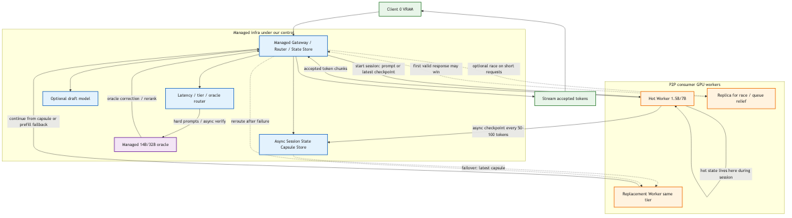

# Summary-State Transformer для WAN-инференса

**Цель:** клиент без VRAM получает LLM-инференс через P2P/WAN-сеть consumer GPU со скоростью порядка **15 tok/s**.

**Главная идея:** не переносить raw KV-cache и не резать модель по слоям. Централизованно обучаем модель, у которой долгий контекст хранится в компактном состоянии: **Session State Capsule**.

**Trust boundary:** Gateway, State Store и Oracle находятся под нашим управлением. P2P-сеть дает consumer GPU compute, но не является источником доверия.

**Важное уточнение:** capsule не пересылается на каждый speculative window. Worker остается hot-stateful на время активной сессии, а capsule используется как переносимый checkpoint для failover и замены worker.



---

## 1. Архитектурный контракт

В нормальном режиме сессия закрепляется за одним worker:

```text
Client 0 VRAM
→ Managed Gateway / Router / State Store
→ choose worker
→ worker keeps hot Session State
→ worker generates with lookahead heads
→ Gateway streams tokens
```

Worker должен быть **replaceable**, а не stateless на каждый токен:

```text
normal path:
  worker keeps current state locally
  gateway sends only new user input / control messages
  worker returns accepted tokens

checkpoint path:
  every N tokens or every S seconds
  worker sends updated Session State Capsule to Gateway / State Store

failover path:
  new compatible worker receives latest capsule
  continues from checkpoint
  if checkpoint is stale/unavailable, fallback = prompt prefill
```

Так мы не убиваем bandwidth передачей 1-5 MB state каждые 200 ms, но сохраняем заменяемость worker.

---

## 2. Session State Capsule

Capsule заменяет стандартный raw KV-cache как **переносимый checkpoint**, а не как per-token payload.

```text
Session State Capsule =
  memory slots
  recent sliding-window tokens
  position / routing metadata
  optional integrity / key-locking metadata
```

Целевой размер capsule:

| Model size | Sliding window | Memory slots | Capsule target | Checkpoint cadence |
| --- | ---: | ---: | ---: | ---: |
| 0.5B | 128-256 tokens | 16-32 slots | 50-200 KB | 20-50 tokens |
| 1.5B | 256-512 tokens | 32-64 slots | 200-800 KB | 20-50 tokens |
| 7B | 512-1024 tokens | 64-128 slots | 1-5 MB | 50-100 tokens |

Bandwidth budget для 7B:

```text
bad:  5 MB every 200 ms  = 25 MB/s  ≈ 200 Mbps
ok:   5 MB every 50 tokens at 15 tok/s ≈ 1.5 MB/s ≈ 12 Mbps
good: delta/checkpoint compression can reduce this further
```

---

## 3. Summary-State Transformer

Это high-risk research, не обычный engineering task. Мы не утверждаем, что можно легко взять Qwen/Llama и "прикрутить memory slots" без потерь. Модель надо обучать под этот state contract централизованно.

Внутри модели:

- attention смотрит на короткое sliding window;
- долгий контекст хранится в фиксированном числе memory slots;
- memory slots обновляются recurrent/attention update;
- размер состояния не растет линейно с длиной диалога;
- lookahead heads генерируют несколько будущих токенов за один remote round-trip.

Минимальный блок:

```text
recent tokens + memory slots
→ sliding attention
→ memory cross-attention
→ MLP
→ updated hidden states
→ memory update
→ lookahead heads
```

Главный риск: capsule может плохо сохранять long-context facts и reasoning. Это проверяется Needle-in-a-Haystack, LongBench, кодом, математикой и multi-turn evals.

---

## 4. Medusa/EAGLE роль

Gateway не обязан генерировать draft window. Для клиента без VRAM идеальный режим:

```text
Gateway sends user input / latest accepted tokens
→ worker runs target model + lookahead heads
→ worker internally proposes and verifies future tokens
→ worker returns accepted token chunk
```

То есть lookahead heads живут на worker вместе с Target-моделью. Gateway может быть тупым роутером без GPU.

Если Gateway производительный, он может дополнительно держать draft model и включать классический speculative decoding, но это optional mode, а не базовый контракт.

---

## 5. WAN-инференс

Почему это учитывает P2P:

- нет pipeline/tensor parallelism через WAN;
- нет raw KV-cache migration;
- нет per-window capsule upload/download;
- hot worker держит state локально во время активной сессии;
- Gateway хранит async checkpoints для failover;
- race execution возможен только на старте сессии или при short requests, где checkpoint cost приемлем;
- latency прячется lookahead window: один RTT должен возвращать несколько токенов.

Целевая математика:

```text
RTT до worker:          80-120 ms
worker lookahead chunk: 40-80 ms
gateway overhead:        5-20 ms
total chunk:           140-220 ms

3 accepted tokens / 200 ms ≈ 15 tok/s
```

Главный KPI: **>= 3 accepted tokens per remote chunk** при RTT около 100 ms.

---

## 6. Как рост сети влияет на качество

Важно: больше одинаковых P2P-воркеров **не делает одну сессию умнее**. Если в сети стало 100 реплик одной и той же 1.5B модели, мы получаем больше throughput, ниже очередь, ниже tail latency и надежнее failover. Качество одной генерации остается качеством 1.5B tier.

Качество может расти только через механизмы, которые реально добавляют вычисление или более сильную модель:

1. **Tier escalation**
   Больше сети означает больше доступных 7B/14B/32B workers. Router может отправлять сложные запросы на более сильный tier.

2. **Managed Oracle**
   Oracle находится под нашим управлением, не в P2P. Он используется как медленный verifier/critic для hard prompts, сложных spans, кода, математики и safety-sensitive ответов.

3. **Best-of-N / self-consistency**
   Несколько workers одного tier могут сгенерировать независимые варианты, а Gateway/Oracle выбирает лучший. Это улучшает качество, но стоит дороже и медленнее, чем обычный режим.

4. **Specialist workers**
   P2P может содержать специализированные fine-tuned workers: code, math, translation, safety, retrieval. Они не "усредняются" с основной моделью, а используются как critics/rerankers/verifiers.

5. **Better centrally trained tiers**
   Основной путь роста качества — обучать более сильные Summary-State tiers: 0.5B → 1.5B → 7B → 14B/32B. Сеть потом масштабирует доступность этих tiers.

Честное ограничение: без oracle/specialists/tier escalation качество ограничено выбранным active tier. 1.5B tier не станет 7B только потому, что в сети много 1.5B реплик.

---

## 7. Plan B для failover

Если Summary-State capsule не удерживает качество или checkpoint устарел:

```text
worker failed
→ Gateway routes to new worker
→ new worker receives raw prompt / conversation text
→ full prefill
→ generation resumes after freeze
```

Это хуже UX, но математически честно и сохраняет качество dense baseline. Для MVP это приемлемый fallback: при отвале ноды пользователь получает freeze 1-3 seconds, а не мусорную генерацию.

---

## 8. Централизованное обучение

Обучаем не просто LLM, а LLM под переносимое state contract.

### Losses

- LM loss на next-token prediction.
- Distillation loss от monolithic Target model.
- Memory retention loss: capsule должна сохранять важный долгий контекст.
- Lookahead loss: heads учатся предсказывать T+1, T+2, T+3...
- Checkpoint recovery loss: модель учится продолжать после загрузки capsule на другом worker.
- Capsule corruption/dropout: устойчивость к частичной деградации state.

### Scaling plan

```text
0.5B Summary-State prototype
→ 1.5B quality/speed point
→ 7B main consumer-GPU tier
→ managed 14B/32B oracle for hard prompts
```

Target model на старте обязательна и находится под нашим управлением:

- teacher для distillation;
- эталон качества;
- oracle во время инференса для сложных запросов.

---

## 9. Что нужно проверить

1. **State viability**
   Может ли capsule держать long-context facts/reasoning без raw KV-cache.

2. **Checkpoint cadence**
   Как часто нужно сохранять capsule, чтобы failover был приемлемым, но bandwidth не умер.

3. **Worker replacement**
   Один worker считает 50 токенов, Gateway сохраняет capsule, другой worker продолжает.

4. **Lookahead acceptance**
   Heads должны давать >= 3 accepted tokens/chunk.

5. **WAN simulator**
   TCP/WebRTC, RTT 50/100/150/250 ms, jitter, packet loss, consumer upload.

6. **7B consumer GPU serving**
   4-bit/8-bit serving на RTX 3060/3090/4090. Цель: 15 tok/s p50 при RTT около 100 ms.

7. **Quality scaling**
   Проверить, что реально улучшает качество: tier escalation, managed oracle, best-of-N, specialist critics. Отдельно зафиксировать, что replica count сам по себе улучшает throughput, а не качество.

---

## 10. Критерии успеха

- **Latency:** около 15 tok/s p50 при RTT около 100 ms.
- **Quality:** 7B Summary-State tier близок к dense 7B baseline на целевых evals.
- **Quality scaling:** улучшение качества достигается через tier escalation / managed oracle / specialist verification, а не через простое число одинаковых реплик.
- **State size:** capsule для 7B в районе 1-5 MB, но checkpoint не чаще чем раз в 50-100 токенов.
- **Failover:** worker replacement через checkpoint capsule; fallback через full prompt prefill.
- **Bandwidth:** checkpoint traffic укладывается в consumer upload, целевой порядок 5-20 Mbps, не 200+ Mbps.
- **Scalability:** больше consumer GPU увеличивает concurrent sessions и снижает queue/tail latency.
