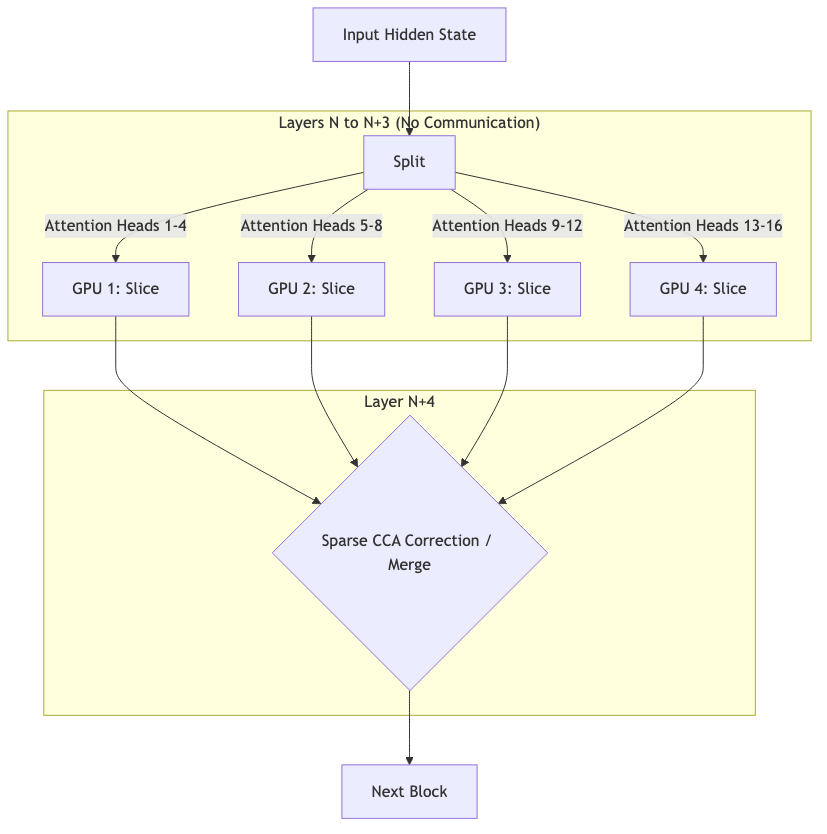

# TP-Surgical: Tensor-Parallel Distributed Inference (LAN)

> **Стрим:** LAN (RTT ~5ms) | **Статус:** текущий фокус 🟢

Архитектура для локальных кластеров с низким пингом (< 5 мс). Validated на 2× RTX 3090: **23.5 tok/s** (2.5× vs single GPU).

Полный контекст стримов: [`../../STREAMS.md`](../../STREAMS.md)

---

## Почему LAN открывает эту архитектуру

TP-Surgical требует **6 сетевых раунд-трипов на токен** (для 24-слойной модели с CCA каждые 4 слоя):
- **WAN:** 6 × 100ms = 600ms/токен → 1.5 tok/s ❌
- **LAN:** 6 × 5ms = 30ms/токен → 33 tok/s ✅

Это та же причина, по которой стандартный Tensor Parallelism используется только внутри датацентра.

---

## Архитектура

**Сценарий:** Несколько GPU объединены в локальную сеть (LAN, PCIe, NVLink).



Вместо того чтобы дублировать слои (как в наивных ансамблях), мы разрезаем attention heads каждого слоя Qwen по воркерам.

- **Sparse Communication:** В отличие от классического Tensor Parallelism, где All-Reduce происходит на *каждом слое*, мы синхронизируемся (Cross-Column Attention, CCA) только **каждые K слоев** (например, каждые 4 слоя).
- **Learned Correction:** На этапе слияния (Merge) добавляется обучаемая поправка (31M параметров), которая компенсирует потерю точности от редкой синхронизации.

```
Qwen weights (shared, sliced by attention head)
         │
   ┌─────┼─────┐
   ▼     ▼     ▼
[GPU 0] [GPU 1] [GPU N]    ← каждый держит slice attention heads
   │     │     │
   └──CCA каждые 4 слоя───┘   ← единственная синхронизация
         │
       Merge (learned correction 31M params)
         │
       LM_Head
```

### Ключевые параметры

| Параметр | Значение |
|---|---|
| Синхронизация | Каждые K=4 слоя (CCA) |
| RTT на токен | 6 RTT (24-слойная модель) |
| Overhead на LAN | 6 × 5ms = 30ms/токен |
| Worker shard size | **~145 MB** (Qwen 0.5B) |

---

## Валидированные результаты (2026-04-26)

### Скорость

| Конфигурация | tok/s | vs single GPU |
|---|---:|:---:|
| 1× RTX 3090 (baseline) | 9.5 | — |
| **2× RTX 3090, LAN** | **23.5** | **2.5×** ✅ |
| 4× RTX 3090, SSH tunnel | 1.25 | 0.13× (SSH overhead) |

> 4-GPU регрессия — SSH tunnel overhead, не архитектурная проблема. Решается raw TCP/RDMA.

### Качество (TP-Surgical Retrofit, Qwen 0.5B)

| Конфигурация | Quality recovery | Trainable params |
|---|---:|---:|
| Frozen + 31M correction CCA | 76% (gap +2.36 nats) | 31M |
| **Unfrozen + 31M correction CCA** | **93% (gap +0.67 nats)** | 747M |

### Surgical-1.5B + SFT (2026-05-01)

| Model | BPB (Wikitext-2) | Gap vs Qwen 1.5B-Instruct |
|---|---:|---:|
| Vanilla Qwen 1.5B (base) | 0.7746 | — |
| Qwen 2.5-1.5B-Instruct | 0.7854 | baseline |
| **Surgical 1.5B + SFT** | **0.8492** | **+8.1%** |

- Alpaca judge (vs Qwen 1.5B base): 18% wins, 32% ties, 50% losses
- Прогресс: 0% wins (0.5B, no SFT) → 18% (1.5B + full pipeline)
- Pipeline cost: **~$50**

---

## Open questions (LAN стрим)

1. **4+ GPU:** SSH tunnel при 4 GPU → 1.25 tok/s. Raw TCP/RDMA нужен. Архитектурно не ограничено.
2. **Skeleton+Fill:** при 4+ GPU bandwidth bottleneck. FIM smoke test в процессе.
3. **7B масштаб:** TP-Surgical slice на 2× RTX 3090 (24GB). ~3-4 GB/GPU. Нужна валидация.
4. **Гетерогенный кластер:** что происходит с 3090 + 4090?

---

## Следующие шаги

| Приоритет | Задача |
|---|---|
| 🔴 High | Raw TCP/RDMA вместо SSH tunnel → 4-GPU тест |
| 🔴 High | Skeleton+Fill end-to-end (ответ на bandwidth bottleneck) |
| 🟡 Med | Surgical-7B LAN тест |
| 🟡 Med | 8-GPU LAN benchmark |
| 🟢 Low | Micro-pod bridge: LAN-кластер как WAN-воркер |

---

## Связь с WAN стримом

LAN-кластер (2-8 GPU) может выступать как **micro-pod** в будущей WAN сети: снаружи — один логический воркер с 30+ tok/s, внутри — TP-Surgical. DST/capsule протокол работает только между micro-pod и Gateway (WAN RTT), но chunk возвращает N токенов за один RTT.
